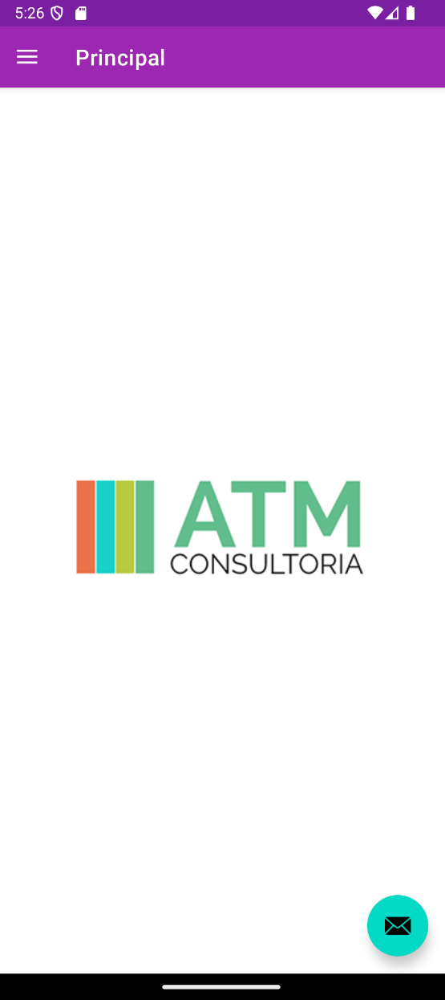
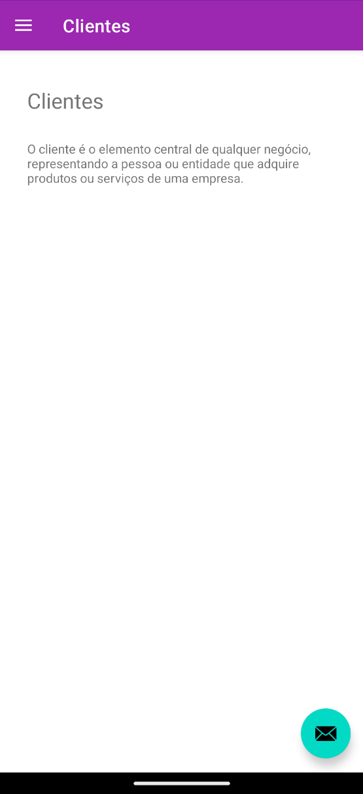
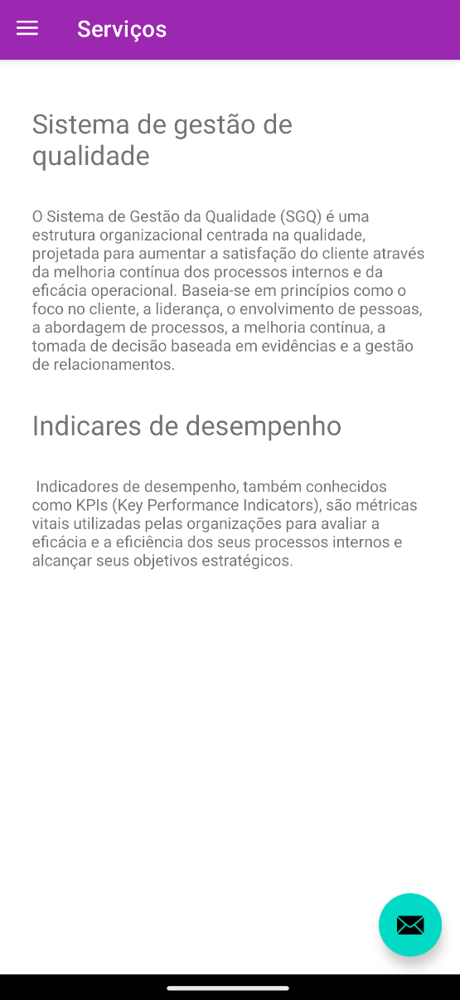

# ATM Consultoria

O **ATM Consultoria** é um aplicativo mobile simples, desenvolvido em **Java para Android**, criado apenas para fins de estudo e teste.

O objetivo principal do projeto foi praticar o uso de **Fragments** no Android Studio, além de treinar a organização de telas e navegação básica dentro de um aplicativo.

# Screenshots

<p align="center">
  
</p>

<br>

<p align="center">
  
</p>

<br>

<p align="center">
  
</p>

# Funcionalidades

- Tela principal
- Tela de clientes
- Tela de serviços
- Tela de contato
- Tela sobre a empresa
- Navegação entre telas usando Fragments

---

# Organização das Pastas

```bash
atmconsultoria/
│
├── ui/
│   ├── clientes/
│   │   └── ClienteFragment.java
│   │
│   ├── contato/
│   │   └── ContatoFragment.java
│   │
│   ├── principal/
│   │   └── PrincipalFragment.java
│   │
│   ├── servico/
│   │   └── ServicoFragment.java
│   │
│   └── sobre/
│       └── SobreFragment.java
│
├── assets/
│   └── images/
│       ├── appbar.png
│       ├── cliente.png
│       ├── principal.png
│       └── servicos.png
│
└── MainActivity.java
```
